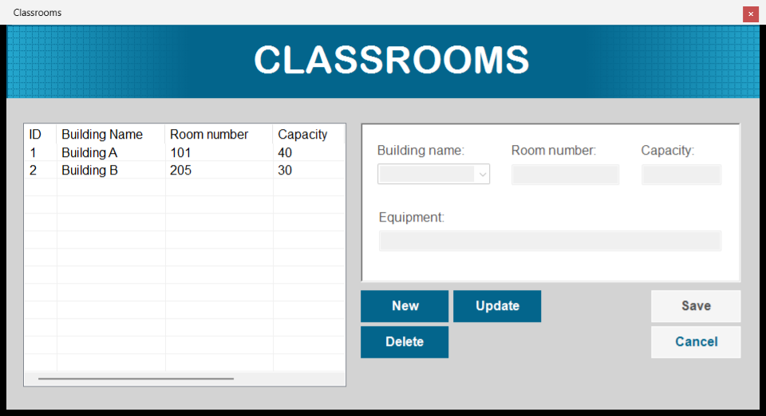
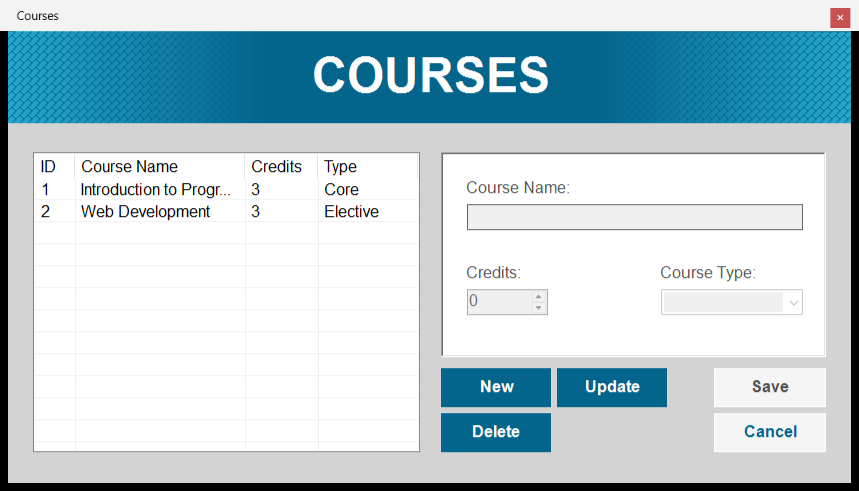
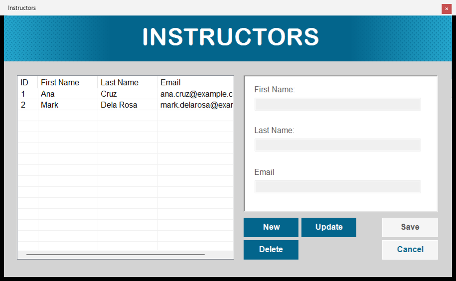
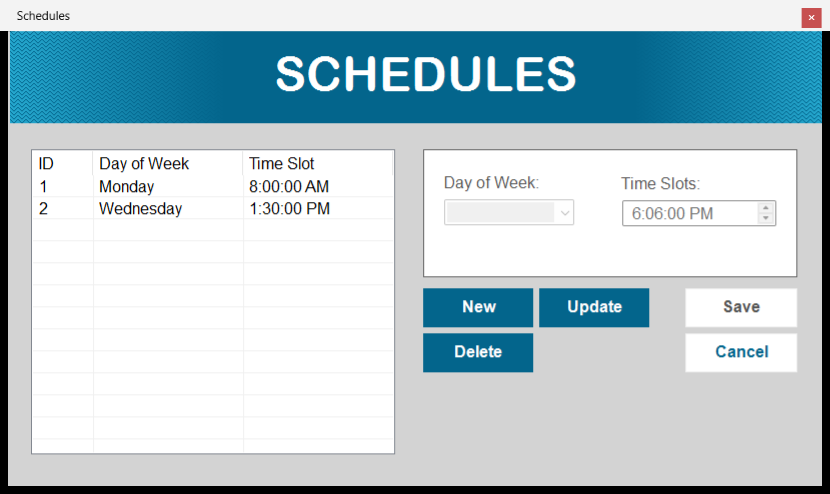
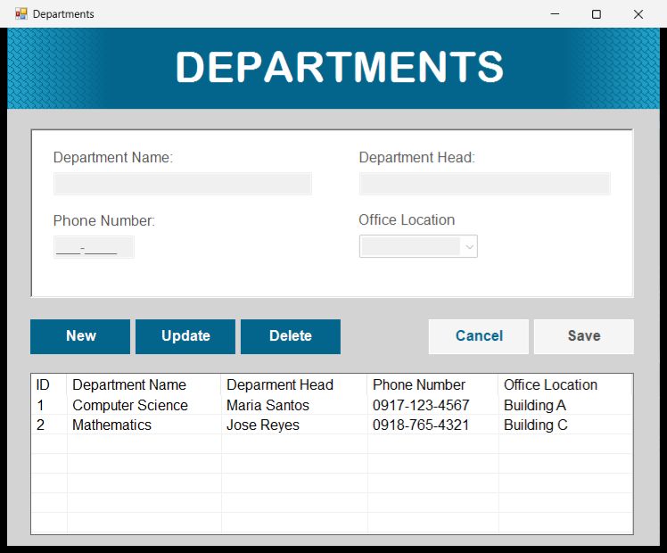

<h1 align="center">simpleCRUD</h1>

<p align="center">
  
  
  
  
  
</p>

<p align="center">
  <b>Download v0.1.1:</b>
  <a href="https://github.com/nncast/vb.net-simple-crud/releases/download/v0.1.1/simpleCRUD-v0.1.1-Windows.zip">Windows (.zip)</a> ·
  <a href="https://github.com/nncast/vb.net-simple-crud/archive/refs/tags/v0.1.1.zip">Source (.zip)</a> ·
  <a href="https://www.youtube.com/watch?v=6MIb-sQymHw">Preview Video</a> |
  <a href="https://github.com/nncast/vb.net-simple-crud/releases">All releases</a>
</p>

**simpleCRUD** is a lightweight desktop application built with VB.NET, demonstrating basic Create, Read, Update, and Delete (CRUD) operations using a MySQL database. It manages basic school records — **Classrooms, Courses, Departments, Instructors and Schedules** — each in its own form.
It is intended as a learning resource or starter template for developers building Windows Forms applications with database integration.

> **Current version: v0.1.1** — bug-fix and security release: every query is parameterized, saving works with MySQL strict mode, the connection settings live in a config file, and there is a ready-to-run Windows build. See [Releases](https://github.com/nncast/vb.net-simple-crud/releases) for the release notes.

<p align="center">
  
  
  
  
    
</p>

## Features

| Module | Fields | Notes |
| --- | --- | --- |
| **Classrooms** | Building name, room number, capacity, equipment | Building picked from Building A–E |
| **Courses** | Course name, credits, course type | Credits via number spinner; type is Core / Elective |
| **Departments** | Department name, department head, phone number, office location | Office picked from Building A–D |
| **Instructors** | First name, last name, email | |
| **Schedules** | Day of week, time slot | Monday–Friday; time chosen with a time picker |

Every form works the same way:

- **New** → fill in the fields → **Save** to add a record (all fields are required)
- **Double-click** a row in the list to load it, then **Update** → **Save**, or **Delete**
- **Cancel** discards the current add/edit
- Every action asks for confirmation first
- Records are displayed in a `ListView`

## Development environment

| Category | Details |
| --- | --- |
| Language | Visual Basic .NET |
| UI | Windows Forms |
| Framework | .NET Framework 4.8.1 |
| Database | MySQL / MariaDB (XAMPP or WAMP) |
| Driver | MySql.Data (MySQL Connector/NET) |
| IDE | Visual Studio 2012 or later |

## Project structure

```
database/
  dbstudent.sql             Database schema + sample data
simpleCRUD/
  simpleCRUD.sln            Visual Studio solution
  lib/MySql.Data.dll        MySQL Connector/NET used by the project
  simpleCRUD/
    App.config              Database connection string (StudentDb)
    Conn.vb                 Shared DB module: opens the connection from App.config; parameterized GetQuery (SELECT) / SetQuery (INSERT/UPDATE/DELETE)
    Classrooms.vb           Classrooms CRUD form
    Courses.vb              Courses CRUD form
    Departments.vb          Departments CRUD form
    Instructors.vb          Instructors CRUD form
    Schedules.vb            Schedules CRUD form (startup form)
    *.Designer.vb / *.resx  Form layouts
    Resources/              Images
    My Project/             App settings, startup form, assembly info
```

## Database

Database name: `dbstudent` — five independent tables:

| Table | Columns |
| --- | --- |
| `classrooms` | `classid` (PK), `bldgname`, `roomnum`, `capacity`, `equipment` |
| `courses` | `courseid` (PK), `coursename`, `credits`, `coursetype` |
| `departments` | `deptid` (PK), `deptname`, `depthead`, `phonenum`, `officelocation` |
| `instructors` | `instrid` (PK), `fname`, `lname`, `email` |
| `schedules` | `schedid` (PK), `dayofweek`, `timeslot` |

All primary keys are `AUTO_INCREMENT`.

## Requirements

| Tool | Download |
| --- | --- |
| Visual Studio 2012 or later | [visualstudio.microsoft.com](https://visualstudio.microsoft.com/downloads/) |
| .NET Framework 4.8.1 or later | [dotnet.microsoft.com](https://dotnet.microsoft.com/en-us/download/dotnet-framework/net481) |
| XAMPP or WAMP (for MySQL) | [XAMPP](https://www.apachefriends.org/index.html) · [WAMP](https://www.wampserver.com/en/) |
| SQLYog or any MySQL client | [SQLYog](https://github.com/webyog/sqlyog-community/wiki/Downloads) |
| MySQL .NET Connector (`MySql.Data.dll`) | Included in `lib/` (from [Connector/NET](https://dev.mysql.com/downloads/connector/net/)) |

## Setup and run instructions

**Windows build (no Visual Studio needed)**

1. Download [`simpleCRUD-v0.1.1-Windows.zip`](https://github.com/nncast/vb.net-simple-crud/releases/download/v0.1.1/simpleCRUD-v0.1.1-Windows.zip) from the [v0.1.1 release](https://github.com/nncast/vb.net-simple-crud/releases/tag/v0.1.1) and extract it.
2. Start MySQL (XAMPP, WAMP, or another server) and import `database/dbstudent.sql` from the extracted folder.
3. If your MySQL server, port, user or password differ from `localhost:3306` / `root` / no password, open `simpleCRUD.exe.config` in Notepad and edit the `StudentDb` connection string.
4. Run `simpleCRUD.exe`.

**From source**

1. Clone the repository, or download the [source .zip](https://github.com/nncast/vb.net-simple-crud/archive/refs/tags/v0.1.1.zip).
   ```bash
   git clone https://github.com/nncast/vb.net-simple-crud.git
   ```
2. Start MySQL using XAMPP, WAMP, or another server stack.
3. Import `database/dbstudent.sql` with SQLYog or another MySQL client, or from the CLI:
   ```bash
   mysql -u root -p < database/dbstudent.sql
   ```
4. Open `simpleCRUD/simpleCRUD.sln` in Visual Studio.
5. If your MySQL settings differ from the defaults, edit the `StudentDb` connection string in `simpleCRUD/simpleCRUD/App.config`. `MySql.Data.dll` ships in the repository's `lib` folder, so nothing else needs to be installed for the reference.
6. Build and run the project.

The app opens the **Schedules** form by default, and there is no main menu linking the forms. To open another module, go to **Project → simpleCRUD Properties → Application → Startup form** and pick `Classrooms`, `Courses`, `Departments`, or `Instructors`.

## Troubleshooting

- **`Unable to connect to any of the specified MySQL hosts`.** Make sure MySQL is running (e.g. started from the XAMPP Control Panel) and that the `StudentDb` connection string in `simpleCRUD.exe.config` (or `App.config` when building) matches your server.

---

*simpleCRUD · 2024 · VB.NET · Windows Forms · .NET Framework 4.8.1 · MySQL*
